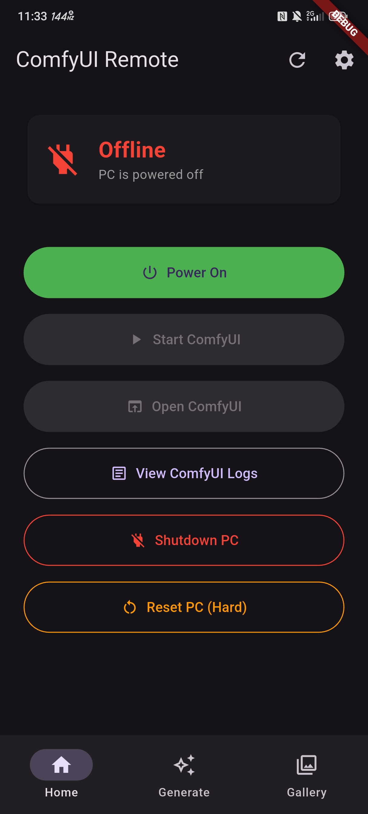
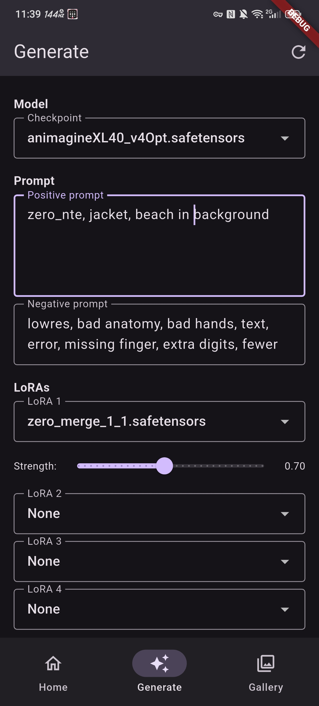
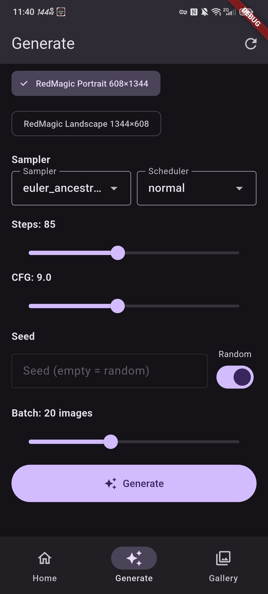
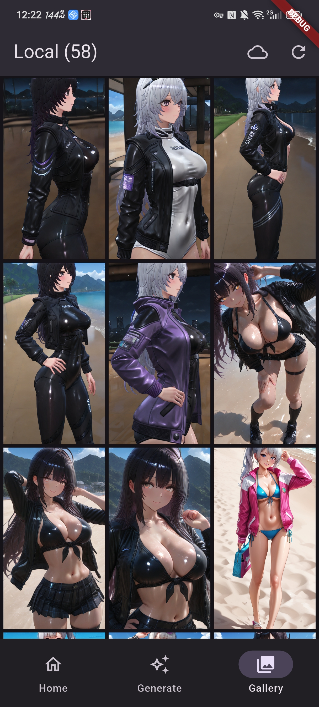

# ComfyUI Remote

A Flutter mobile app for remotely controlling ComfyUI from your phone or tablet.

---

## Table of Contents
- [Features](#features)
- [Notes](#notes)
- [Screenshots](#screenshots)
- [Planned Features](#planned-features)
- [Requirements](#requirements)
- [Setup](#setup)
- [Building](#building)
- [Project Structure](#project-structure)
- [ComfyUI Workflow](#comfyui-workflow)
- [License](#license)

---

## Features

### 🔌 Power & Connectivity
- Turn your PC on/off via **Tuya smart plug** (optional)
- **Hard reset** (power cycle) for frozen PC (requires Tuya)
- Real-time PC status monitoring (Offline → Booting → Online → ComfyUI Ready)
- Remote **SSH control** — start ComfyUI, view logs, shutdown PC
- **Windows & Linux server support** — toggle between OS in settings
- **GPU selector for Linux** — NVIDIA, AMD (ROCm) or CPU
- **Custom ComfyUI path** — use default or set a custom installation path

### 🎨 Image Generation
- 4 LoRA slots with strength sliders
- Sampler, scheduler, steps, CFG, denoise controls
- **Custom resolution** input + RedMagic 10S Pro presets
- **Upscale toggle** (RealESRGAN x2 via UltimateSDUpscale)
- Batch generation (up to 50 images)
- **Generation queue** — add jobs while current batch is running
- **Settings snapshot** — changing settings mid-batch doesn't affect current job
- **Foreground service** — generation continues with screen locked, with notification showing progress
- **Battery optimization exemption** — Android won't kill the app during long batches

### 🖼️ Gallery
- Browse locally saved images and ComfyUI history
- Swipeable fullscreen viewer with **pinch & double-tap zoom**
- Page lock when zoomed in (no accidental swipes)
- **9:16 aspect ratio** grid for portrait images
- **Pull to refresh** in local gallery
- Multi-select delete
- Load generation settings from image PNG metadata
- Remote gallery filters out deleted/missing images automatically

### ⚙️ Settings & Persistence
- Generation settings saved to **phone's** `Downloads/ComfyUI/settings.json`
- Workflow embedded in saved PNGs for settings recovery
- Tablet layout with side navigation rail (iPad support)

---

## Notes

- Generated images are saved to **phone's** `Downloads/ComfyUI/` folder with embedded workflow metadata
- Generation settings can be restored from any saved image via Gallery → fullscreen → tune icon
- The app connects to ComfyUI running on your **PC/server** — it does not run ComfyUI locally on the phone
- ComfyUI history tab shows images stored on the **PC's** output folder — local tab shows images saved on the **phone**
- Tested on **RedMagic 10S Pro** (Android 16) and **OnePlus Ace 3** (Android 14)
- ⚠️ **iOS/iPadOS** — code is implemented but not yet tested on a real device
- ⚠️ **Linux server support** — implemented but not yet tested, feedback welcome

---

## Screenshots

| Home | Generate (top) | Generate (bottom) | Gallery |
|------|---------------|------------------|---------|
|  |  |  |  |

---

## Planned Features

### 🔌 Networking
- ✅ **Windows & Linux server support** — toggle between OS in settings
- ✅ **GPU selector for Linux** — NVIDIA, AMD (ROCm), CPU
- ✅ **Custom ComfyUI path** — default or custom installation path
- ✅ **Local ComfyUI detection** — auto-discover ComfyUI instances on the local network (fast & thorough scan modes)
- 🔲 **Multi-instance selector** — detect multiple ComfyUI machines and switch by name
- 🔲 **mDNS/Bonjour discovery** — zero-config connection without manually entering IP
- 🔲 **Connection profiles** — save multiple server configurations and switch quickly

### 🎨 Generation
- ✅ **Generation queue** — queue multiple jobs, processed sequentially
- ✅ **Settings snapshot** — settings locked at generation time
- ✅ **Custom resolution input** — enter any width/height instead of fixed presets
- ✅ **Upscale toggle** — RealESRGAN x2 toggle visible in UI
- ✅ **LoRA strength sliders** — individual strength bar under each LoRA selector
- 🔲 **Image to video** — send generated images directly to Wan 2.2 I2V workflow
- 🔲 **Text to video** — T2V workflow support from the generate screen
- 🔲 **Prompt history** — save and reuse previous prompts
- 🔲 **Wildcard support** — random prompt variations

### 🔔 Notifications
- ✅ **Background notifications** — foreground service shows generation progress
- ✅ **Battery optimization exemption** — Android won't kill the app during long batches
- 🔲 **Push notifications** — notify when generation is complete (even when app is closed)
- 🔲 **Generation progress** — live step counter during generation

### 🖼️ Gallery
- ✅ **Double-tap zoom** — zoom in at tap position with smooth animation
- ✅ **Page lock when zoomed** — no accidental image swipes while panning
- ✅ **9:16 aspect ratio** — portrait grid layout
- ✅ **Pull to refresh** — manual refresh in local gallery
- ✅ **404 filtering** — remote gallery hides missing/deleted images
- 🔲 **iPad split view** — side-by-side generate and gallery panels
- 🔲 **Image tagging** — tag and filter generated images
- 🔲 **Favorites** — mark and filter favorite generations

### ⚙️ Management
- 🔲 **Model manager** — browse and download models directly from the app
- 🔲 **LoRA browser** — preview and manage installed LoRAs
- 🔲 **ComfyUI workflow import** — load custom workflows from JSON files

---

## Requirements

- Flutter 3.x+
- Android 10+ or iOS 16+
- ComfyUI running on a Windows or Linux machine accessible via Tailscale or local network
- SSH access to the server
- Tuya smart plug (optional) — required only for remote power on/off and hard reset

---

## Setup

### 1. Clone the repo

```bash
git clone https://github.com/truszcz/ComfyUI-Mobile-Remote.git
cd ComfyUI-Mobile-Remote
flutter pub get
```

### 2. Configure the app

Open the app and go to **Settings** (gear icon), fill in:

| Setting | Description |
|---|---|
| ComfyUI URL | e.g. `http://100.82.84.36:8000` |
| Server OS | Windows or Linux |
| SSH Host | Tailscale IP of your server |
| SSH User | Your username |
| SSH Password | Your password |
| Tuya Client ID | Optional — from Tuya IoT Platform |
| Tuya Client Secret | Optional — from Tuya IoT Platform |
| Tuya Device ID | Optional — your smart plug device ID |

### 3. Tuya setup

1. Create an account at [iot.tuya.com](https://iot.tuya.com)
2. Create a Cloud Project (EU region)
3. Link your smart plug device
4. Copy Client ID, Client Secret and Device ID to app settings

### 4. SSH setup

The app uses SSH to:
- Check if PC is reachable
- Start ComfyUI
- View ComfyUI logs
- Shutdown PC

On Windows enable OpenSSH Server in **Settings → Optional Features → OpenSSH Server**.

### 5. iOS only — allow HTTP

Add this to `ios/Runner/Info.plist`:

```xml
<key>NSAppTransportSecurity</key>
<dict>
    <key>NSAllowsArbitraryLoads</key>
    <true/>
</dict>
```

---

## Building

### Android

```bash
flutter build apk --release
```
APK at `build/app/outputs/flutter-apk/app-release.apk`

### iOS (requires Mac + Xcode)

```bash
flutter build ios
open ios/Runner.xcworkspace
```

---

## Project Structure

```
lib/
├── main.dart                   # App entry, navigation shell (phone/tablet)
├── screens/
│   ├── home_screen.dart        # PC power control and status
│   ├── generate_screen.dart    # Image generation UI
│   ├── gallery_screen.dart     # Local and remote image gallery
│   └── settings_screen.dart    # App configuration
└── services/
    ├── settings_service.dart   # SharedPreferences wrapper
    ├── tuya_service.dart       # Tuya smart plug API
    ├── ssh_service.dart        # SSH commands
    ├── comfy_service.dart      # ComfyUI API + workflow builder
    ├── generation_prefs.dart   # Generation settings persistence
    └── png_metadata.dart       # PNG tEXt chunk reader/writer
```

---

## ComfyUI Workflow

The app builds a clean API-format workflow supporting:
- `CheckpointLoaderSimple`
- Up to 4 chained `LoraLoader` nodes
- `CLIPTextEncode` (positive + negative)
- `EmptyLatentImage`
- `KSampler` (with denoise)
- `VAEDecode`
- `SaveImage`
- Optional `UltimateSDUpscale` with RealESRGAN_x2

---


## License

MIT
